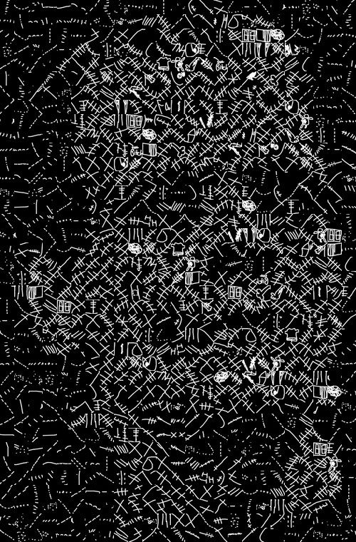
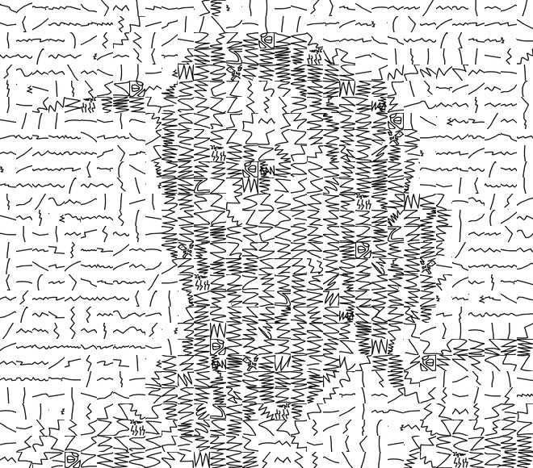

Mosaic builder for building photomosaic-style mosaics intended for use with pen plotters.




Currently works with images from the Quick Draw dataset at https://quickdraw.withgoogle.com/data

This code is derived from code used to make raster photomosaics originally written for the book Flickr Hacks. I've added additional scripts to produce raster thumbnail previews of what the various doodles look like when drawn in black or white ink.  These thumbnails are used by the build_mosaic script to construct a raster photomosaic in the usual way (by selecting thumbnails that match the desired target picture).  Once the appropriate doodles are selected, information about the tileset is output to a JSON file and a JPG preview is made from the thumbnails.  The saved JSON data can then be used, in conjunction with the original binary files from Quick Draw, to produce an SVG which can be plotted.

Required software packages:
```
PIL/Pillow 2.0+       (https://pypi.org/project/Pillow/)
svgwrite   1.0+       (https://pypi.org/project/svgwrite/)
gsutil                (see https://cloud.google.com/storage/docs/gsutil_install)
```

Scripts
```
make_sample.sh       # make a sample mosaic from scratch (illustrates use of the following 4 scripts)

get_bins.py          # download a collection of bin files from quickdraw
make_thumbs.py       # produce raster thumbnail images for an image set
build_mosaic.py      # photomosaic builder - reads thumbnails and outputs a JPG preview and JSON layout.
render_mosaic_svg.py # render mosaic data from a json layout file to an SVG

imageset.py          # code used by build_mosaic
mosaick.py           # code used by build_mosaic
mosaic_constants.py  # code used by build_mosaic

```

Directories
```
thumbs\               # thumbnails and image lists are stored here by make_thumbs
bdata\                # binary files are placed here by get_desired_bins.py
jdata\                # json tile layouts are placed here by build_mosaic
renders\              # preview images are placed here by build_mosaic
samples\              # some sample output
targets\              # target photos

```